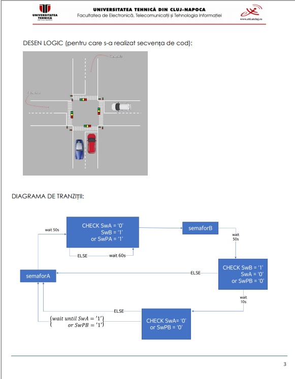

# FPGA Smart Traffic Light Controller

A hardware traffic light controller I designed and implemented on a Basys3 FPGA board for my digital systems course. I used VHDL to model the entire system as a Finite State Machine, with sensor-based adaptive logic that dynamically adjusts signal timing based on traffic conditions.

## What I built

- Modeled the full system as a Finite State Machine (FSM) in VHDL, ensuring deterministic and reliable signal state transitions.
- Implemented sensor-driven adaptive logic that automatically prioritizes busy lanes and adjusts signal timing in real time.
- Added pedestrian crossing support with automatic priority switching between Street A and Street B.
- Synthesized and deployed the design on a Basys3 FPGA board using Vivado, including pin constraint configuration.

## Project Structure

- `TrafficLightController.vhd` — top-level module
- `Finit_State_Machine.vhd` — Finite State Machine logic
- `DivizorFrecventa.vhd` — clock frequency divider
- `Basys3.xdc` — pin constraints for Basys3 board

## State Diagram

